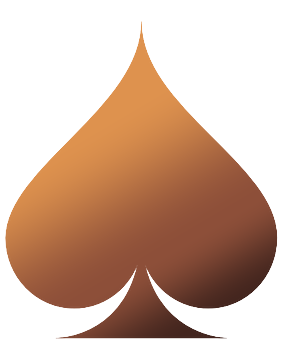

    </img>
    <h1 align="center">rustyjack</h1>
    
A single-player console blackjack game.

## Installation

- [📦 Install Rust](https://rust-lang.org/tools/install)

In order to run the program:

1. Clone the repository.
2. Go to the cloned folder.
3. Run `cargo run --release` and enjoy!

## License

This software is licensed under the [MIT License](./LICENSE).
